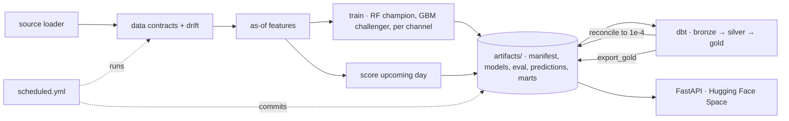

# Ev Charging Data Unified Schema

Consolidates five messy partner feeds into one tested dbt schema on DuckDB.

Every published number traces to a committed evaluation artifact; the pipeline runs unattended
for $0/month: a frozen scikit-learn model, a dbt medallion warehouse (DuckDB locally, MotherDuck
in production), a FastAPI service on a Hugging Face Space,
and dbt docs on GitHub Pages.

> Generated from [ds-dbt-stack-template](https://github.com/cbratkovics/ds-dbt-stack-template).
> Until the stub loader is replaced (docs/TEMPLATE_GUIDE.md) every number below describes
> synthetic data and is illustrative.

## Architecture



```
ev_charging_data_unified_schema/    config.py (PROJECT) · interfaces.py · data/ (loader, contracts) · target.py · features/asof.py
                 models/ (train, registry) · eval/ (evaluator, drift, model_card) · pipeline/ (score, scheduled) · serve/
dbt/             ev_charging_data_unified_schema_dbt — bronze / silver / gold, snapshot, tests, macros, exposures
artifacts/       committed: manifest.json · models/<version>/ · eval/<eval_id>.json · predictions/<season>/ · marts/*.parquet · schemas/
tests/           leakage, loader, evaluator, drift, policy, contracts wrapper, API contract, interfaces, config mirrors, dbt incremental equivalence
docs/            MODEL_CARD (generated) · ARCHITECTURE · DATA_SOURCES · REPRODUCIBILITY · TEMPLATE_GUIDE · SECOND_USE_CHECKLIST · adr/
```

## Results

Numbers live in [docs/MODEL_CARD.md](docs/MODEL_CARD.md), generated from `artifacts/eval/*.json`;
`scripts/check_model_card.py` fails CI while the card is a placeholder. Cite the `eval_id`.

## Run locally

```bash
make install        # uv venv + pinned toolchain
make bootstrap      # train + evaluate + score one period (stub loader)
make test           # pytest
make dbt-dev        # dbt deps + build the warehouse (.duckdb/dev.duckdb)
make api            # http://127.0.0.1:7860/docs
```

## What runs on a schedule

`scheduled.yml` (`0 10 * * 2`): pull → contracts → drift → score → shadow challenger →
publish / hold / promote → dbt prod build → export marts → commit → mirror the Space. HOLD opens an
Issue and fails the job. See docs/ARCHITECTURE.md.

## Limitations

* Synthetic stub data until the loader is replaced.
* Drift thresholds are uncalibrated (`ev_charging_data_unified_schema/eval/drift.py`); the job cannot HOLD on drift until they are.
* One feature scheme (`asof_v1`); intervals are empirical residual quantiles, not guarantees.
