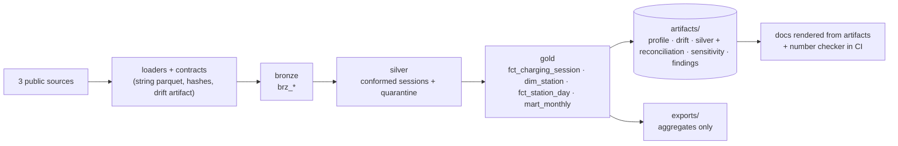

# EV charging data, unified schema

[](https://github.com/cbratkovics/ev-charging-data-unified-schema/actions/workflows/ci.yml)
· [dbt docs](https://cbratkovics.github.io/ev-charging-data-unified-schema/) (live once Pages is enabled)
· [Findings](docs/FINDINGS.md)
· [Portfolio card](docs/CARD.md)

**The problem.** Three public operators publish EV-charging session logs in three shapes: one
file holding two overlapping deliveries with mixed timestamp formats, one export with true UTC
timestamps but no end time, and one national publication split across four files whose headers,
date formats and duration units differ. None publishes port counts, so the denominator of every
utilization figure has to be inferred. The job was to conform all of it into one tested schema on
DuckDB, prove that nothing was lost between raw and gold, and say only what the data supports.

**What was built.** An ingestion layer that lands every file as strings with hashes and checks it
against a declared contract; a bronze / silver / gold dbt warehouse with a quarantine that keeps
every rejected row and its reasons; a station dimension with inferred capacity and its stated
bias; a station-day fact on a full spine with sessions split at local midnight; committed
artifacts for profiling, drift, reconciliation, denominator sensitivity and findings; a number
checker that fails CI when a documented figure has no artifact key; and an `exports/` read
contract of aggregates only.

| Source | What it is | Period | Licence |
|---|---|---|---|
| Boulder, CO | city charging transactions, one CSV holding two deliveries | 2018-01 to 2023-11 | CC0 (item metadata) |
| Cary, NC | town-owned station sessions, UTC timestamps, no end time | 2012-04 to 2023-01 | CC0 1.0 (dataset metadata) |
| UK Department for Transport | Electric Chargepoint Analysis 2017, rapids and fasts raw files plus the publisher's anomalies files | 2017 | Open Government Licence v3.0 |

Endpoints, verbatim licence text and retrieval hashes: [docs/DATA_SOURCES.md](docs/DATA_SOURCES.md).
Only sources with an explicit open licence are used ([ADR-0004](docs/adr/0004-source-policy.md)).



## Results

<!-- generated:results start -->
_Rendered by `scripts/render_docs.py` from `artifacts/findings/findings-20260920T025549Z.json` and `artifacts/silver/silver-20260920T025526Z.json`; a ratio of summed minutes over summed available port minutes, never an average of daily percentages; ports are inferred lower bounds, so these are upper bounds on utilization._

| Source | Period | Utilization (production port count) | Range across denominator definitions |
|---|---|---|---|
| boulder | 2018-01 to 2023-11 | charging-time 6.2% | 5.8% (robust_max_n1) to 6.8% (trailing_90d_max) |
| boulder | 2018-01 to 2023-11 | connected-time 11.4% | 10.5% (robust_max_n1) to 12.4% (trailing_90d_max) |
| cary | 2012-04 to 2023-01 | charging-time 7.1% | 6.1% (robust_max_n1) to 7.4% (robust_max_n10) |
| dft_2017 | 2017-01 to 2017-12 | connected-time 8.7% | 8.7% (production) to 11.4% (robust_max_n10) |

Reconciliation status (both identities, every source and month): **non_blocking**. Sources cover different years and countries; nothing here compares one with another.
<!-- generated:results end -->

Three findings, each within one source with its period, keys, sensitivity range and what the
data cannot show: [docs/FINDINGS.md](docs/FINDINGS.md).

## What this demonstrates

- Conforming differently shaped sources to one fact grain and one contract, with drift handled
  by declared schemas instead of surprises ([docs/CONTRACTS.md](docs/CONTRACTS.md)).
- Non-additive ratios rebuilt from summed numerator and denominator at every rollup, never
  averaged, with a test that shows the two differ on this data.
- Inferred capacity with its bias stated in both directions and a committed sensitivity
  artifact instead of a single number.
- Idempotent incremental loads under re-delivery: a late file with a changed value and a vanished
  row produces exactly what a full refresh would.
- Row and kWh reconciliation with every residual classified blocking or not, and nothing dropped
  silently.
- Claim discipline enforced by CI: every measured number in the docs resolves to a committed
  artifact key, and rendered blocks are checked against the artifacts.

## Run it offline

```bash
make install      # uv venv + pinned toolchain
make dbt-fixture  # land the hand-built fixture and build the whole warehouse from it
make test         # pytest: contracts, drift, DST, dedup, idempotency, reconciliation, checker
```

`make ingest && make dbt-dev` downloads the real sources (network) and builds from them;
`make release` regenerates every artifact, export and rendered document at one commit.
`scripts/smoke.sh` runs the offline sequence from a fresh clone in a temporary directory, so
nothing that exists only on one machine can make it pass.

## Design decisions

Grouped by theme; each ADR is one file under [docs/adr/](docs/adr/) and the amended brief is
[docs/BRIEF.md](docs/BRIEF.md).

- **Sources and licences.** Explicit open licence or nothing; two candidate sources were dropped
  for having none. Raw rows are never committed, only manifests, aggregates and hashes; user-level
  fields never reach silver ([ADR-0002](docs/adr/0002-source-redistribution.md),
  [ADR-0003](docs/adr/0003-personal-data.md), [ADR-0004](docs/adr/0004-source-policy.md)).
- **Contracts, drift and quarantine.** One contract per source and file family; unknown columns
  warn, missing or retyped required columns quarantine the file, renames are aliased. Every
  rejected row keeps all its failing reasons plus one primary reason by fixed precedence, so counts
  sum ([ADR-0008](docs/adr/0008-drift-policy.md), [ADR-0009](docs/adr/0009-phase-3-amendments.md)).
- **Time and duration.** Wall-clock local timestamps proven on DST transition dates, true UTC
  proven by a seasonal shift; durations computed from UTC and compared with the published ones;
  tolerances derived from each row's timestamp precision; nothing imputed across sources
  ([ADR-0005](docs/adr/0005-session-contract-amendments.md), [ADR-0010](docs/adr/0010-phase-4-amendments.md)).
- **Capacity.** Ports are the larger of two lower bounds (published connector ids, observed
  concurrency reached on at least five days), floored at one, with the binding bound recorded and
  the active window trimmed of long gaps; a sensitivity artifact reports utilization under every
  definition ([ADR-0006](docs/adr/0006-capacity-denominator.md),
  [ADR-0007](docs/adr/0007-phase-2-amendments.md), [ADR-0012](docs/adr/0012-port-bounds-and-registry-cut.md)).
- **Gold and incremental loads.** Source-level replace driven by file hashes carried on the fact
  rows; a station × local-date spine; sessions split at local midnight with a stated allocation
  rule; a deterministic SCD2 snapshot ([ADR-0011](docs/adr/0011-gold-design-amendments.md)).
- **Claims and artifacts.** Two reconciliation identities per source and month; findings rendered
  from their own artifact; living docs cite `latest.json`, ADRs cite point-in-time files; a checker
  in CI ([ADR-0013](docs/adr/0013-reconciliation-findings-citations.md)).
- **CI and exports.** Offline CI on a hand-built fixture; a monthly full build that never commits
  and opens an issue when upstream data changed or outputs regressed; exports of aggregates only
  ([ADR-0015](docs/adr/0015-ci-exports-and-the-scheduled-build.md)).

## Corrections

Three places where the data overturned the plan:

- The brief assumed ambiguous fall-back times resolve to the first occurrence; DuckDB resolves
  them to the second, and nonexistent spring-forward times shift forward an hour. Verified
  empirically, adopted, pinned by a test ([ADR-0009](docs/adr/0009-phase-3-amendments.md)).
- Rounding a charging-window end to whole minutes overlapped back-to-back sessions at a single-port
  station and inferred a second port; found by reading two checkpoints against each other, fixed
  with second precision and a SQL-versus-Python coherence test ([ADR-0014](docs/adr/0014-phase-6-coherence-defects.md)).
- The publisher's stated exclusion rule does not describe its anomalies file: most excluded rows
  meet no stated criterion and thousands are duplicates of rows the revision moved elsewhere. The
  rule is reproduced as a flag and the whole population is accounted for in one table
  ([FINDINGS.md](docs/FINDINGS.md), [ADR-0014](docs/adr/0014-phase-6-coherence-defects.md)).

## Limitations

- Port counts are inferred lower bounds; availability is assumed 24 hours a day within a station's
  active window. <!-- param --> The inference undercounts ports never used concurrently (biasing
  utilization upward) and overcounts where overlapping records are data errors (biasing it downward).
- No source records queues, arrivals or turned-away drivers, so idle time is a ceiling on
  recoverable capacity, not demand.
- The sources cover different years and countries; findings are within-source only.
- Charging is assumed to begin at session start; the sources publish no charging profile. Where a
  source lacks a duration type the measure is null, never imputed.
- DfT rows with no charge-point id stay in the totals under an unknown-station key but carry no
  capacity; their share is in the silver summary artifact.
- Raw rows are not committed; reproducing the artifacts from scratch needs the live portals.

## How it was built

AI-assisted with Claude Code, under a written brief and phase-gated owner review: each phase
ended with a checkpoint, the owner's amendments went into the brief and an ADR, and the data
overturned the plan more than once (see Corrections). [docs/BRIEF.md](docs/BRIEF.md) and the
ADRs are the record.

## Independence and attribution

This is an independent project on public open data. It contains no employer-derived code,
data, names, schemas, thresholds or business rules; all logic derives from the public sources
above and the reasoning recorded in this repository.

Contains public sector information licensed under the Open Government Licence v3.0.
